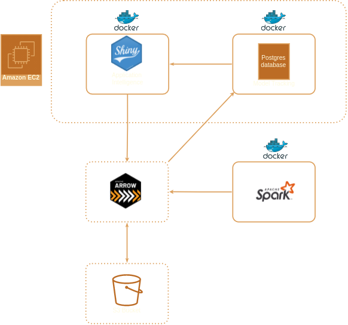
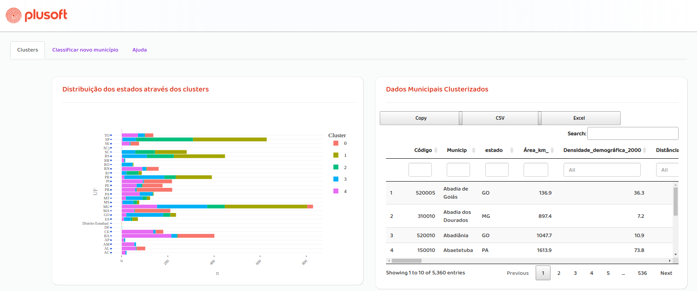

&nbsp;

 <p align='center'>  </p>
 
&nbsp;


#

Poneglyph is an optimized distributed advanced analytics as a service framework designed to be highly ***efficient***, ***flexible*** and ***scalable***.
It implements machine learning algorithms such as [UMAP](https://en.wikipedia.org/wiki/Nonlinear_dimensionality_reduction#Uniform_manifold_approximation_and_projection) and [Gaussian Mixture Models](https://en.wikipedia.org/wiki/Mixture_model#Gaussian_mixture_model) to yield insights and shed light on business, industry and scinentific questions. 

# 
- [Community](https://xgboost.ai/community) 
- [Documentation](https://xgboost.readthedocs.org) 
- [Resources](demo/README.md) 
- [Contributors](CONTRIBUTORS.md) 
- [Release Notes](NEWS.md)

#### Features 

#


#### Application Structure:
<p align="center">
  
</p>

#### Directory Structure
```
.
├── app
│   ├── data
│   │   ├── raw
│   │   │   └── dados_municipais.csv
│   │   └── transformed
│   │       ├── clustered_dataset
│   │       ├── dados_limpos.csv
│   │       └── UMAP_embeddings.csv
│   ├── index.html
│   ├── rsconnect
│   │   └── shinyapps.io
│   │       └── jailson-rodrigues
│   │           └── Cluster-test.dcf
│   ├── server.R
│   ├── src
│   │   └── R
│   │       ├── libs.R
│   │       ├── modules
│   │       │   ├── inputs.R
│   │       │   └── outputs.R
│   │       ├── multiClassSummary.R
│   │       └── MyGgthemes.R
│   ├── ui.R
│   └── www
│       ├── alert.js
│       └── style.css
├── appscreen.png
├── data
│   ├── raw
│   │   └── dados_municipais.csv
│   └── transformed
│       ├── clustered_dataset
│       ├── dados_limpos.csv
│       └── UMAP_embeddings.csv
├── README.md
├── src
│   ├── clustering.py
│   ├── Dockerfile
│   ├── ranking.py
│   └── sankey.R
└── UMAP-GMM.ipynb


```

#### Screenshots

<p align='center'>  </p>

