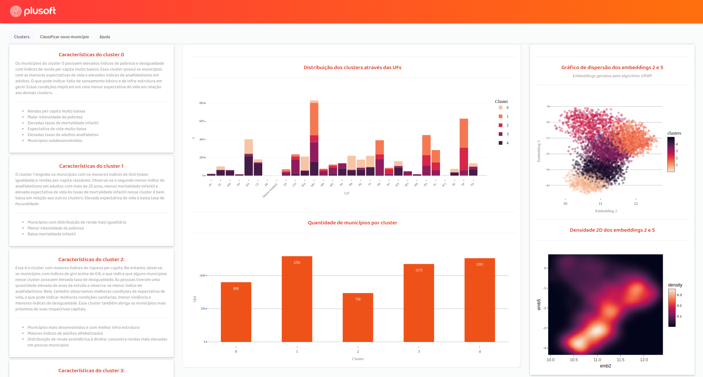

<p align="center">
  
</p>
 
----
[Community](https://xgboost.ai/community) |
[Documentation](https://xgboost.readthedocs.org) |
[Resources](demo/README.md) |
[Contributors](CONTRIBUTORS.md) |
[Release Notes](NEWS.md)

XGBoost is an optimized distributed gradient boosting library designed to be highly ***efficient***, ***flexible*** and ***portable***.
It implements machine learning algorithms under the [Gradient Boosting](https://en.wikipedia.org/wiki/Gradient_boosting) framework.
XGBoost provides a parallel tree boosting (also known as GBDT, GBM) that solve many data science problems in a fast and accurate way.
The same code runs on major distributed environment (Kubernetes, Hadoop, SGE, MPI, Dask) and can solve problems beyond billions of examples.
Acesse a versão em desenvovimento do App em: https://jailson-rodrigues.shinyapps.io/Cluster-dev/

## Project Structure

```
.
├── app
│   ├── data
│   │   ├── raw
│   │   │   └── dados_municipais.csv
│   │   └── transformed
│   │       ├── clustered_dataset
│   │       ├── dados_limpos.csv
│   │       └── UMAP_embeddings.csv
│   ├── index.html
│   ├── rsconnect
│   │   └── shinyapps.io
│   │       └── jailson-rodrigues
│   │           └── Cluster-test.dcf
│   ├── server.R
│   ├── src
│   │   └── R
│   │       ├── libs.R
│   │       ├── modules
│   │       │   ├── inputs.R
│   │       │   └── outputs.R
│   │       ├── multiClassSummary.R
│   │       └── MyGgthemes.R
│   ├── ui.R
│   └── www
│       ├── alert.js
│       └── style.css
├── appscreen.png
├── data
│   ├── raw
│   │   └── dados_municipais.csv
│   └── transformed
│       ├── clustered_dataset
│       ├── dados_limpos.csv
│       └── UMAP_embeddings.csv
├── README.md
├── src
│   ├── clustering.py
│   ├── Dockerfile
│   ├── ranking.py
│   └── sankey.R
└── UMAP-GMM.ipynb


```

## Screenshots



### Application Structure:
<p align="center">
  
</p>
